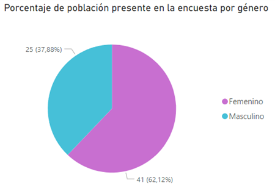
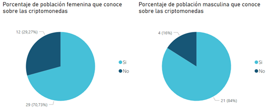
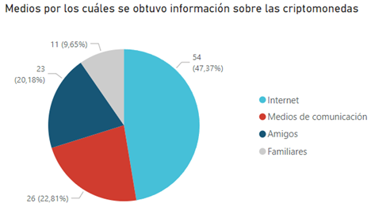
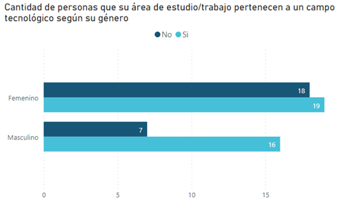
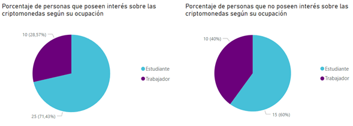
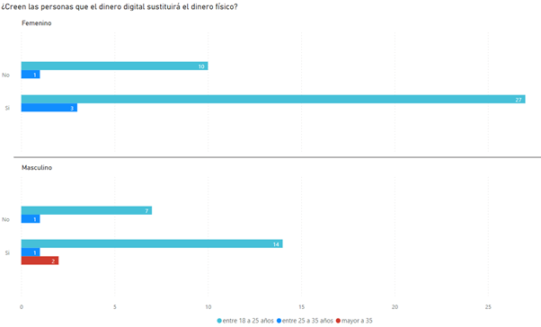
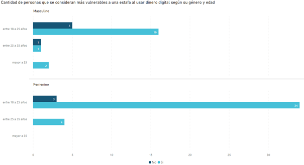

# Criptomonedas y su Impacto a Nivel Mundial

Autores: Bryan Umaña López, Luis Delgado Jiménez, Jarot Carmiol Barrantes, Kevin Arias Ávila
 
 

### Contenido
- [Objetivos](#objetivos)
  - General
  - Específicos
- [Resumen](#resumen)
- [Abstract](#abstract)
- [Introducción](#introducción)
- [¿Qué son las criptomonedas?](#qué-son-las-criptomonedas)
- [Crecimiento mundial de criptomonedas](#crecimiento-mundial-de-criptomonedas)
- [Efectos del aumento en las criptodivisas.](#efectos-del-aumento-en-las-criptodivisas)
- [El impacto de las divisas digitales en el mundo](#el-impacto-de-las-divisas-digitales-en-el-mundo)
- [Criptomonedas en la Actualidad](#criptomonedas-en-la-actualidad)
- [Marco Metodológico](#marco-metodológico)
- [Conclusión](#conclusión)
- [Recomendación](#recomendación)
- [Bibliografía](#bibliografía)

 
 

## Objetivos
**General**: 
Explicar la manera en cómo la criptomoneda desde diferentes ámbitos ha influido al rededor del mundo.
 
 
**Específicos**:
- Definir que son las criptomonedas, como están compuestas y en que se basa su funcionamiento.
- Identificar las razones por las cuales las criptomonedas tuvieron un aumento espontáneo.
- Señalar cuales fueron las consecuencias a causa del incremento de la moneda.
- Mencionar los diferentes puntos de vista que entidades gubernamentales y personas especulaban acerca de las criptomonedas.
- Evaluar la situación que la criptomoneda presenta en la actualidad y el impacto que generó en la sociedad.

## Resumen
Hoy en día el avance tecnológico brinda muchas nuevas alternativas, lo que nos lleva a la transformación o el cambio en la manera que se realizan transacciones tanto presenciales como en línea, dejando casi que un poco de lado la moneda física. Las criptomonedas son un claro ejemplo de este caso, debido a que se han posicionado en el mercado financiero permitiéndoles así ser un método de pago a través de una plataforma conectada al internet, con la diferencia de que este no cuenta con ningún tipo de regulador oficial para identificar su trazabilidad. Esta herramienta de pago cada vez cobra más importancia a nivel mundial, ya sea por el número de usuarios que las utilizan o por la gran cantidad de dinero y especulación que generan. Por lo que a lo largo de este trabajo se contextualizará acerca de esta moneda, su evolución en los sistemas económicos y el grado de aceptación que ha llegado a tener.
 **Palabras clave: Criptomoneda, Dinero digital, Blockchain, Wallet**

## Abstract
Nowadays, technological progress provides many new alternatives, which leads us to the transformation or change in the way transactions are made both in person and online, leaving almost a little aside the physical currency. Cryptocurrencies are a clear example of this case because they have positioned themselves in the financial market allowing them to be a payment method through a platform connected to the internet, with the difference that this does not have any kind of official regulator to identify its traceability. This payment tool is becoming increasingly important worldwide, either because of the number of users who use them or because of the large amount of money and speculation they generate. Therefore, throughout this paper we will contextualize this currency, its evolution in economic systems and the degree of acceptance it has achieved.
 **Keywords: Cryptocurrency, Blockchain, Wallet**

## Introducción
En la actualidad el desarrollo de tecnologías nuevas ha traído o logrado grandes cambios a la sociedad, integrando en la vida cotidiana procesos o mecanismos que ayudan a realizar sus actividades de manera rápida, segura y eficaz.
Dentro de estos desarrollos o avances se puede contemplar el modo en que hoy en día se manipula el dinero, esto refiriéndose a que las personas tienen las posibilidades de controlar sus saldos bancarios y cuentas, además de poder realizar transacciones desde y a cualquier parte del mundo de una manera casi inmediata.
Mencionados avances o innovaciones se dan como consecuencia a raíz de los cambios que la sociedad como consumidores va adquiriendo, generando algunas veces un poco de desequilibrio entre las economías y finanzas.
Para nadie es un secreto que la tecnología ha afectado muchas cosas rompiendo todo tipo de barreras, tanto así que ha generado una evolución financiera muy marcadas, tanto así que las monedas que se conocen se virtualicen.
Actualmente se puede escuchar el término de criptomonedas porque se ha vuelto común, porque es un tema que ha dado de que hablar, por el desarrollo que tuvo y tiene en el sector económico y esto se da más que todo porque irrumpió en cómo se basa la economía, los negocios y hasta la propia gobernabilidad siendo estos pilares de la sociedad.

## ¿Qué son las criptomonedas?
Una cripto-moneda (El prefijo “cripto-” de la palabra “criptomoneda” significa “secreto” en griego) también conocida como criptoactivos. Las criptodivisas son un activo digital, es decir que cumplen con las funciones de una moneda tal como el dólar o en nuestro caso los colones, pero con la diferencia de que estas son totalmente en línea y emplean un cifrado criptográfico esto con el fin de asegurar sus transacciones financieras, controlar cuando se da la creación de nuevas unidades evitando que se creen copias de una misma, como también verificar las transferencias de activos. Por lo que se consideraría este activo como una alternativa descentralizada a otras monedas virtuales, con esto se quiere dar a entender que estas monedas no son controladas por un intermediario, entidades o bancos. Esto gracias a la criptografía que permite que las transacciones sean anónimas, seguras y confiables.

Pero para entender un poco más estas monedas o su funcionamiento se debe conocer otros conceptos tales como wallet, mineros, exchanges y Blockchain. Entonces qué son estos conceptos, bueno se comentará primero el termino wallet, este hace referencia a una cartera, billetera o monedero virtual en donde va a estar almacenado toda criptomoneda que tengamos y se realizarán las operaciones de recepción y envío a través de la red Blockchain.
Pero ¿Qué es Blockchain o cadena de bloques?, bueno básicamente es una red de ordenadores descentralizada con diferentes nodos, donde sus nodos están enlazados y asegurados por el tema de criptografía, en cada bloque enlazado se encontrará también una fecha y datos de transacción y por este diseño es que son muy resistentes a la modificación de datos. 

Se podría decir que es una base de datos distribuida y segura. Sin embargo, hay un requerimiento muy importante para que la cadena funcione y es que debe haber varios usuarios (nodos) para que se realicen las verificaciones, validación y respectivo registro de las transacciones dentro de la cadena. Esta última línea es importante porque los bloques tienen capacidades limitadas que dependen de la estructura de la cadena y del tamaño de la transacción, entonces lo que ocurre cuando un bloque llega al límite es decir no admite más transacciones, llega el momento de validarlo o sellarlo que es lo que hacen los usuarios cuando minan, esto está siendo mencionado porque en este punto es donde entra el concepto antes mencionado de minería o mineros.

El minar básicamente consiste en realizar una serie de cálculos sumamente complejos que requieren tiempo, pero cuando el proceso es finalizado, los bloques quedan registrados de forma permanente en la cadena y no pueden ser modificados sin afectar o alterar los demás bloques. Al hacer esto el minero recibe como recompensa la criptomoneda que esté minando. Pero esto cada vez es más complicado, se vuelve un proceso más costoso por lo que normalmente lo que se hace es que muchos mineros utilizando algún software específico se unen a más mineros creando lo que se conoce como “pools” y lo que sucede es que cuando uno de los mineros descubre la solución avisa a los demás, que proceden a comprobar que sea correcta la solución y añaden ese bloque a la cadena de bloques completa.

El último, pero no menos importante es el concepto de los “exchanges”, que en una manera sencilla de expresar son empresas que te van a permitir cambiar monedas como dólares o colones por Bitcoins, añadiéndolos así a tu antes mencionada wallet y así ya estar introducido en este mundo de criptomonedas.

## Crecimiento mundial de criptomonedas
A partir de mediados del 2020 las criptomonedas, comenzaron a tener un crecimiento sustancial con respecto a sus años anteriores, esto es debido a que muchas grandes empresas por razones como: protegerse frente a la inflación de las divisas, proveer transparencia y mayor seguridad a la hora de realizar transacciones, diversificar el portafolio de la compañía, entre otros. Llevo a las compañías a realizar inversiones en criptodivisas, el realizar estas acciones permitió que el valor de la moneda virtual conocida como Bitcoin comenzara a elevarse y esto a su vez provoco que las demás monedas que utilizan el Bitcoin como referencia elevaran su precio.  Pero no solo se debió a la inversión de las compañías, la minería también contribuyo a este a aumento, pero contribuyo de una manera que podría considerarse fuera de lo que ya era normal dentro de la minería de las criptomonedas. Esto se debió a una moneda conocida como Ethereum. 

El poder computacional requerido para la minería de esta moneda no era tan exigente como el del Bitcoin, lo cual, hacia posible que usuarios con computadores que contaran con tarjetas gráficas les fuera posible minar Ethereum, esto significa que cualquier persona desde la comodidad de su hogar que contara con un computador que utilizara una tarjeta gráfica de potencia media podría realizar minería de Ethereum, solamente con encender su computador y abrir el programa especializado para realizar este proceso. 

Al inicio los medios digitales presentaban a los lectores pensamientos u opiniones negativas acerca de la minería, pero debido a la situación de la pandemia, los medios digitales comenzaron a presentar la minería como una posible opción para afrontar la situación relacionada al desempleo, lo que impulso a usuarios comunes a realizar minería, todo esto bajo el efecto FOMO (“Fear Of Missing Out” traducido al español “Miedo a perderse algo”) permitiendo que el Ethereum elevara su valor, los usuarios comunes comenzaron a replicar lo mismo que usuarios especializados realizaban, cambiaban su Ethereum por Bitcoin o directamente cambiaban dólares por Bitcoin. Este evento se extendió a lo largo del 2021, teniendo dos fases durante ese año. 

Lo primero fue la inclusión de nuevos mineros, el proceso se basó en su mayor parte en prestar poder computacional para minar Bitcoin, y a los mineros se les pagaba en Ethereum, esto, aunque no provoco un gran aumento en el momento, poco a poco se fue contribuyendo al incremento del valor de Bitcoin. Este fue el punto de partida para explotar el Ethereum, presentándose como una moneda estable. La segunda fase fue la creación y expansión de los NFTs, lo cual en pocas palabras puede describirse como documento digital el cual fue utilizado como un archivo de autorización de transacciones en el Blockchain y ahora posee un valor único en todo el espacio digital. 
Estos documentos comenzaron a comercializarse, bajo el argumento de que “a cambio de tu Ethereum tendrás un archivo único en todo el internet” lo cual hizo que muchas personas empezaran a comprarlos, en un inicio parecía una idea extraña para quienes lo compraban pero para quienes los creaban era un negocio rentable ya que la gran mayoría de NFTs eran imágenes, esto provoco que estos documentos digitales se vendieran a precios muy altos, como las cripto divisas son bastante volátiles muchas personas no tomaron suficiente importancia, pero debido a este negocio, el valor comenzó a crecer tanto que las personas ahora pagan cantidades de dinero por conseguir uno. Debido a todos estos factores el 7 de noviembre del 2021 el bitcoin alcanza un valor histórico de $67,566 y por esto el mundo cambia su pensar acerca de las criptomonedas y como afectaran en el futuro.

## Efectos del aumento en las criptodivisas.
Debido al notable aumento en el valor de las monedas virtuales, esto provoco diversas reacciones alrededor del mundo. Podemos observar casos como el de El Salvador que tomó la decisión de adoptar el Bitcoin como una moneda de circulación legal, en la ley aprobada se menciona que se puede utilizar esta moneda para realizar pagos de bienes e impuestos. 

En el caso de otros países como China, se declaró como ilegal cualquier actividad relacionada con las criptomonedas. Incluyendo servicios como comercio de activos digitales, emisión de tokens y derivados. Por otra parte, a medida que la demanda de Ethereum, la red de cadena de bloques más utilizada aumentó, surgieron otros proyectos en un intento de competir. Como ejemplo tenemos “Avalanche” y “Solana”, las cuales fueron lanzadas desde el 2020 como plataformas para contratos inteligentes y la creación de aplicaciones descentralizadas. Cada plataforma presentaba un nuevo token, AVAX y SOL, respectivamente, estos nuevos competidores saltaron a las 10 principales criptomonedas y ganaron participación de mercado entre el resto en el 2021. 

Ethereum por su parte lanzó EIP-1559 y se preparó para la fusión con Ethereum2. La actualización, llamada “London”, incluía la propuesta de mejora de Ethereum (EIP) 1559, que cambió la forma en que se estiman las tarifas de transacción o "tarifas de gas" (se refiere a el cobro que se realiza por extraer la moneda minada de una plataforma para almacenarla en una wallet). 

Se espera que, en algún momento de 2022, Ethereum cambie a un modelo de prueba de participación, donde los usuarios solo pueden validar las transacciones de acuerdo con la cantidad de monedas que tienen, en lugar de utilizar las plataformas mineras de uso intensivo de energía. Este movimiento es parte de la fusión con Ethereum 2.0 o Eth2. Esto presenta un gran impacto, ya que cambiará la infraestructura de Ethereum y en última instancia, hará que la minería quede obsoleta.

## El impacto de las divisas digitales en el mundo
Las criptomonedas son una consecuencia de la era digital y del desarrollo impetuoso de las tecnologías de la información y las comunicaciones (TIC). Con el paso de los años, han aparecido más de 3 000 nuevas monedas digitales y los inversionistas mundiales cada vez le prestan más atención. Grandes tiendas, virtuales y físicas, ya las aceptan como medios de pago. 

Debemos recordar que en este método de pago no existe una autoridad ni bancos centrales que gestionen el sistema ni nadie que sea su propietario. Su aceptación dependerá, en última instancia, de la confianza que genere la moneda. Debido a este podemos preguntarnos:
¿Qué están haciendo los gobiernos y los bancos centrales frente a esta disrupción?

Costa Rica es uno de los pocos países en Latinoamérica que posee una de las regulaciones más abiertas sobre el uso de Bitcoin y las criptomonedas. Según un reciente estudio, parte de la opinión pública apunta a que el país se ha quedado rezagados frente a otros países en el ámbito de adoptar Bitcoin.

En Estados Unidos, según Jerome Powell, miembro del directorio y presidente designado de la Reserva Federal, aún existe poca confianza en el sistema: “El gobierno y la gestión del riesgo serán críticos” asegura. Adicionalmente, frente a la posibilidad de una criptomoneda propia del banco central, la privacidad es un tema que aún falta por explorar a profundidad. En contraste con esta posición, Estados Unidos es el país que más transacciones realiza con criptomonedas. De hecho, es bastante común en sectores tecnológicos como Silicon Valley.

Por otra parte, Japón es uno de los pocos países en el que, el comercio con Bitcoin está totalmente aceptado. De hecho, cuenta con más de 200.000 establecimientos comerciales que lo usan activamente. No obstante, según el gobernador de Banco del Japón, Haruhiko Kuroda, comenta que no existe ningún plan inmediato de emitir monedas digitales.

Europa también se hace presente frente al estado actual de las criptodivisas. El Banco Central Europeo constantemente advierte sobre los peligros de invertir en monedas digitales. Además, relacionan las criptomonedas con temas como la evasión fiscal y tráfico de productos ilegales.

En contraste a lo que advierte el Banco Central Europeo, en Reino Unido, Mark Carney, gobernador del Banco de Inglaterra se muestra muy positivo frente a la “revolución” que las criptomonedas plantean para potenciar las finanzas. Así mismo, ve muy promisoria la tecnología Blockchain debido a la seguridad que ofrece frente a ciberataques a entidades financieras.

A su vez, en Holanda, El Banco Central creó su propia criptomoneda, el DNBcoin, con el fin de entender el funcionamiento y despliegue que tendría. Después de analizar los resultados, Rob Berndsen, quien estuvo a cargo del proyecto, exaltó los beneficios del Blockchain al ser aplicable al pago de transacciones financieras complejas.

China por su parte, posee un equipo de investigación creado desde 2014. El Banco Popular de China está desarrollando un dinero digital de curso legal. Adicionalmente, dicha institución tiene el control total de las criptomonedas lo que hace que emisores privados como el Bitcoin sean prohibidos en este territorio.

Suiza, ahora es más conocida como “Crypto Valley” ya que en ella se han desarrollado importantes proyectos como el Ethereum. Asimismo, es un “paraíso del emprendimiento” ya que el gobierno apoya constantemente las iniciativas tecnológicas. Su aceptación es tal que existen ciudades donde se pueden pagar tanto los impuestos como las matrículas universitarias con Bitcoin.

## Criptomonedas en la Actualidad
En pleno 2022 una gran parte de la población no conoce de gran manera acerca de las criptomonedas, solo tienen como concepto que es una moneda digital y que en estos últimos años han obtenido un gran valor en cuestión monetaria, entonces podemos observar que ahora esas personas buscan “aventurarse” en este nuevo negocio.

En noticieros y periódicos se han publicado o comentado a acerca de las criptomonedas como un nuevo método de pago. Lo cual también ha incentivado a las personas a utilizar de sus ahorros para adquirir estos bienes electrónicos. Sin embargo, es todavía algo incipiente para lo que aún nos queda mucho por aprender. Esto también ha hecho que los estafadores aprovechen cualquier descuido. Según datos de la FTC (Federal Trade Commission), entre octubre de 2020 y mayo de 2021, los estadounidenses perdieron unos 80 millones de dólares en estafas relacionadas con las criptomonedas.

Debemos recordar que hay que ser precavidos con la información que recibimos, y aunque el negocio de las criptomonedas se desarrolla de muchas maneras no debe caerse en las típicas trampas para conseguir dinero fácil. Es bueno mencionar que este mundo de las criptomonedas al ser descentralizada cada persona es dueña de su propia información por lo tanto debe seguirse la regla básica de protección y no brindar ningún dato sensible que pueda comprometer a la persona involucrada. 

Aunque este negocio novedoso parezca una gran oportunidad para generar dinero, siempre debe estarse informado para evitar cualquier tipo de fraude. Es posible ver a personas llegar a ciertos extremos todo por pensar que pueden llegar a desaprovechar una gran oportunidad en este negocio en crecimiento.

Con el auge de las criptomonedas, podemos observar por otra parte, empresas comenzar a surgir bajo este tipo de negocio como lo es el ejemplo de Criptan. El cual se podría definir como un criptobanco con el cual es posible comprar, almacenar e incluso obtener ganancias de las criptomonedas. Criptan busca acercar las ventajas de las criptomonedas y todo el sistema blockchain al día a día de las personas.

Por otra parte, en este nuevo mundo influenciado por las criptomonedas, según un informe especializado en social trading de la empresa financiera eToro, un año antes de la pandemia, el porcentaje de mujeres que invertía en bitcoins habría aumentado. 

Se observa que las mujeres representan el 23% de los usuarios de las monedas digitales que se encuentra en el mercado y se mujeres que se interesen en este sector. No es de negar que la presencia de la mujer cada vez es mayor, el estudio ya antes mencionado nos indica que una gran parte de las mujeres inversoras de criptomonedas son ingenieras desarrolladoras y otras ingenieras de datos. 

## Marco Metodológico
Las nuevas tecnologías y el ciberespacio se encuentran en constante actualización y crecimiento. El propósito de este estudio es comprobar cómo se han visto influenciadas las personas con respecto al desarrollo que las criptomonedas han tenido en los últimos años. Específicamente se desea responder a la pregunta ¿Se han vuelto las criptomonedas un tema de interés en la vida diaria? 

Un diseño no experimental transversal, más específicamente un diseño por encuesta, fue el que se utilizó para este estudio sobre una muestra seleccionada a partir de una población general de los círculos sociales de los integrantes. La encuesta principalmente buscaba obtener datos sobre la cantidad de personas que sienten interés sobre las criptomonedas, cuales fueron los medios que más hicieron llegar contenido sobre las criptomonedas, y como se sentirían si tuvieran que hacer uso de estas. 

Este tipo de diseño permite ser utilizado en diversos grupos de personas asegurando la confidencialidad del usuario que la realiza y siendo la forma más eficaz para obtener información de manera fácil y rápida, además permite al investigador el uso de herramientas adicionales para el análisis de los datos que se encuentran relacionados en otros puntos de la encuesta.

Como resultado una vez reunida, comprendida y estructurada la información proporcionada por medio de mencionada encuesta, se obtuvo el análisis de los gráficos presentados a continuación:

###### Gráfico 1 porcentaje de población

Por medio de la encuesta realizada se pudo observar que el porcentaje de participación de mujeres con respecto a los hombres es un 24,24% mayor, lo cual puede ser considerado una buena señal, debido a que se aprecia que la cantidad de mujeres interesadas en el tema de las criptomonedas ha incrementado. [ver gráfico 1](#gráfico-1-porcentaje-de-población)

###### Gráfico 2 porcentaje de conocimiento

Como se aprecia en el gráfico en ambos sexos la mayoría de las personas poseen conocimiento acerca de las criptomonedas. Siendo un 84% de hombres y un 70,73% de mujeres quienes poseen conocimiento acerca del dinero digital. Esto dando a entender que cada vez el tema está más presente en la vida diaria de las personas. [ver gráfico 2](#gráfico-2-porcentaje-de-conocimiento)

###### Gráfico 3 rango de edades

Además, se descubrió que la mayor influencia de los temas relacionados a las criptomonedas se encuentra en una gran parte entre las personas de 18 a 25 años correspondiendo al 87,88% de las personas que realizaron la encuesta. [ver gráfico 3](#gráfico-3-rango-de-edades)

###### Gráfico 4 medios de información

Ya sea de foros web, redes sociales o videos. Internet es el medio que más ha propagado información sobre las criptomonedas con un 24,56% más que los medios de comunicación tradicionales como la radio, TV o periódicos no digitales. Reflejando el impacto de la distribución de información que puede llegar a generar el internet en la población. [ver gráfico 4](#gráfico-4-medios-de-información)

###### Gráfico 5 área tecnológica

Los resultados muestran que gran parte de las mujeres que no estudian o trabajan en un área relacionada a la tecnología, también se ven involucradas en temas relacionados con las criptomonedas al igual que las que sí lo hacen, por otra parte, en los hombres podemos observar de manera más común que su área de estudio o trabajo se encuentre relacionada a la tecnología. En esta ocasión se realizó la pregunta porque normalmente se tiene un punto de vista de que las personas que tienen relación en estudios con tecnología van a estar más interesadas en las criptomonedas, sin embargo, se contempla en esta ocasión que no es así del todo. [ver gráfico 5](#gráfico-5-área-tecnológica)

###### Gráfico 6 interés-desinterés

También fue posible determinar del total de personas encuestadas, cuánto interés existe hacia el mercado de las criptomonedas de acuerdo a la perspectiva del estudiante al igual que la de los trabajadores, de la misma forma, se posibilita determinar el desinterés que existe hacia el mercado de las criptomonedas respecto a estas mismas perspectivas. [ver gráfico 6](#gráfico-6-interés-desinterés)

###### Gráfico 7 sustitución por divisa digital

Con los datos recopilados es posible determinar que más de la mitad las personas consideran que las criptodivisas pueden llegar a sustituir el dinero físico, apreciando que quienes más consideran esto son las personas que componen el rango de edad entre los 18 a los 25 años. [ver gráfico 7](#gráfico-7-sustitución-por-divisa-digital)

###### Gráfico 8 vulnerabilidad frente a estafas

Del mismo modo fue posible concluir que gran parte de las personas que formaron parte de la encuesta consideran que serían más vulnerables a ser víctimas de una estafa utilizando dinero virtual. Donde nuevamente, se puede apreciar que el rango de edad donde más se considera ser víctima de una estafa es el de los 18 a 25 años. [ver gráfico 8](#gráfico-8-vulnerabilidad-frente-a-estafas)

Con toda la información que fue presentada es posible afirmar, que con el paso de los años los temas relacionados con las criptomonedas han ido tomando lugar en la vida diaria de muchas personas, sin importar el género los medios de comunicación se han encargado de propagar cualquier información relacionada a las criptodivisas teniendo como objetivo principal la población más joven. Aun así, existe cierta incertidumbre frente a este nuevo mercado, ya que muchas personas consideran que estas criptodivisas tienen una posibilidad de remplazar el dinero físico y al no entender del todo su funcionamiento, da como resultado inconformidad y una gran preocupación en ciertas partes de la población.

## Conclusión
El aumento de las criptomonedas ha afectado al mundo de diversas maneras, desde países que la han usado para beneficiarse, hasta países que han prohibido su uso total. Es un tema que aún sigue en discusión en entidades bancarias y su uso descontrolado podría traer grandes problemas. Ser consientes acerca de las facilidades y consecuencias que las criptodivisas presentan puede permitir a la humanidad a darles un gran uso y mejorar los sistemas comerciales que actualmente se utilizan. 

Debemos tomar en cuenta que, al ser una moneda descentralizada, a muchas entidades no les gusta la idea de no tener control sobre la misma. Aun así, la popularización y masificación de las divisas digitales es algo que viene en aumento y debemos aprender a convivir con ellas y utilízalas de la mejor manera posible, ya que, aunque si bien no es cierto que puedan llegar a remplazar el dinero físico, es muy probable que convivan en el mismo mercado como cualquier otra divisa ya existente.

## Recomendación
Dentro de este gran tema, se sugiere que siempre se busque información de diversos medios, ya que siempre existen diferentes puntos de vista, como es el caso de que cuando algo en el mundo de las criptomonedas va bien o va mal la gran parte de los medios hablaran sobre el tema para evitar la mal información en las personas. Además, se desea que los lectores tomen en cuenta que estas nuevas maneras de comercio buscan expandirse y tener un posicionamiento estable en la actualidad, dando como resultado que busquen trabajar de las mejores maneras posibles incluso tratando de brindar mayor seguridad que los métodos tradicionales de pago que actualmente existen. 

Se busca que no haya entidades de terceros observando o manipulando las transacciones que se realizan para evitar un uso indebido de esta nueva tecnología de pago para el intercambio de bienes ya sea digitales o físicos. La tecnología y digitalización trae muchos cambios, de los cuales la criptomoneda está presente, por lo que informarse un poco respecto a todo el tema en general puede ser una recomendación a tener en cuenta, porque tarde o temprano la sociedad tendrá que adaptarse a estos cambios, por lo que como personas se deberían cuestionar, ¿qué es mejor?, ¿tener un conocimiento mínimo? o ¿un conocimiento nulo?

## Bibliografía
2020: La tormenta perfecta para Bitcoin, Ethereum y todas las criptomonedas (RESUMEN DEL AÑO!). (2020, 21 diciembre). YouTube. Recuperado 10 de abril de 2022, de https://www.youtube.com/watch?v=WYcCulLuDJI 
Bitcoin 2021: ¿por qué sube el precio del Bitcoin? (2021, 21 enero). Bancolombia. Recuperado 10 de abril de 2022, de https://www.bancolombia.com/wps/portal/empresas/capital-inteligente/tendencias/tendencias-globales/por-que-sube-precio-bitcoin 
Confidential, C. (2020, 27 abril). Bitcoin Hits April High; Crypto Portfolios Get Stimulus Injection. Forbes. Recuperado 10 de abril de 2022, de https://www.forbes.com/sites/cryptoconfidential/2020/04/26/bitcoin-hits-april-high-crypto-portfolios-get-stimulus-injection/ 
Locke, T. (2021, 27 diciembre). From bitcoin hitting $1 trillion in market value to Elon Musk’s dogecoin tweets: 12 key crypto moments from 2021. CNBC. Recuperado 10 de abril de 2022, de https://www.cnbc.com/2021/12/27/12-key-moments-that-fueled-cryptos-record-growth-in-2021.html 
Stevens, R. (2021, 20 diciembre). Bitcoin: cuáles son las razones de que su precio suba o baje. CoinDesk. Recuperado 10 de abril de 2022, de https://www.coindesk.com/learn/2021/12/20/bitcoin-cuales-son-las-razones-de-que-su-precio-suba-o-baje/#:%7E:text=Los%20analistas%20creen%20que%20esto,auge%20del%20mercado%20de%20stocks.&text=Bitcoin%20tambi%C3%A9n%20ha%20reaccionado%20a%20otras%20crisis%20del%20mercado 
Beatrice, A. (2021, 7 septiembre). 10 Reasons Why Businesses Should Invest in Cryptocurrency. Analytics Insight. Recuperado 10 de abril de 2022, de https://www.analyticsinsight.net/10-reasons-why-businesses-should-invest-in-cryptocurrency/ 
How have cryptocurrencies performed in 2021? (2022, 8 febrero). World Economic Forum. Recuperado 10 de abril de 2022, de https://www.weforum.org/agenda/2022/01/top-cryptocurrencies-performance-2021/#:%7E:text=Along%20with%20gamification%2C%202021%20saw,hundred%20percent%20to%20finish%20off 
Kharpal, A. (2021, 17 noviembre). Bitcoin briefly drops below $60,000 as major cryptocurrencies fall. CNBC. Recuperado 10 de abril de 2022, de https://www.cnbc.com/2021/11/16/bitcoin-btc-drops-toward-60000-as-major-cryptocurrencies-plunge.html 
Kollewe, J. (2021, 9 noviembre). Bitcoin price surges to record high of more than $68,000. The Guardian. Recuperado 10 de abril de 2022, de https://www.theguardian.com/technology/2021/nov/09/bitcoin-price-record-high-cryptocurrencies-ethereum 
Salzman, A. (2021, 11 febrero). Not Just Tesla: Why Big Companies are Buying into Crypto-Mania. Barron’s. Recuperado 10 de abril de 2022, de https://www.barrons.com/articles/not-just-tesla-why-big-companies-are-buying-into-crypto-mania-51613069805 
Wikipedia contributors. (2022, 28 marzo). Fear of missing out. Wikipedia. Recuperado 10 de abril de 2022, de https://en.wikipedia.org/wiki/Fear_of_missing_out 
Bitcoin: actualidad, videos, informes y análisis. (2022, 26 marzo). France 24. Recuperado 10 de abril de 2022, de https://www.france24.com/es/tag/bitcoin/ 
¿Cuáles son las criptomonedas más negociadas? | Plus500. (s. f.). Plus500. Recuperado 10 de abril de 2022, de https://www.plus500.com/es/Trading/CryptoCurrencies/What-are-the-Most-Traded-Cryptocurrencies%7E2 
Economía 3. (s. f.). Noticias de Criptomonedas : Actualidad y artículos. Economia3. Recuperado 10 de abril de 2022, de https://economia3.com/economia/criptomonedas/ 
Esquerdo, M. (2022, 20 enero). Aumentan las estafas en el mundo de las criptomonedas, ¿cómo podemos evitarlas? Economia3. Recuperado 10 de abril de 2022, de https://economia3.com/2022/01/17/469453-criptomonedas-aumento-de-las-estafas-en-un-mundo-sin-apenas-regulacion/ 
Jimeno, G. (2022, 31 enero). Jorge Soriano (Criptan): «Las criptomonedas sustituirán a las tradicionales». Economia3. Recuperado 10 de abril de 2022, de https://economia3.com/2022/01/28/470631-criptan-las-criptomonedas-sustituiran-a-las-tradicionales/ 
Martínez, J. (2022, 13 enero). Se buscan criptogirls: atraer a las mujeres, el reto del sector de las criptomonedas. Economia3. Recuperado 10 de abril de 2022, de https://economia3.com/2022/01/13/469163-se-buscan-criptogirls/ 
Plazas, N. (2021, 24 diciembre). ¿Qué son las criptomonedas y a qué se debe su vertiginoso auge? France 24. Recuperado 10 de abril de 2022, de https://www.france24.com/es/econom%C3%ADa-y-tecnolog%C3%ADa/20211224-criptomonedas-bitcoin-blockchain-especulacion-mineria 
Arroyo, M. (2021, 13 octubre). Costa Rica podría ser el próximo país en adoptar bitcoin en Latinoamérica. CriptoNoticias - Noticias de Bitcoin, Ethereum y criptomonedas. Recuperado 10 de abril de 2022, de https://www.criptonoticias.com/comunidad/adopcion/costa-rica-podria-proximo-pais-adoptar-bitcoin-latinoamerica/ 
Escoda, A. (2014, 11 marzo). Bitcoin: ¿burbuja especulativa o moneda del futuro? CaixaBank. Recuperado 10 de abril de 2022, de https://www.caixabankresearch.com/es/economia-y-mercados/mercados-financieros/bitcoin-burbuja-especulativa-o-moneda-del-futuro 
Osorio, J. (s. f.). ¿Cómo ven los principales bancos a las criptomonedas? COBIS. Recuperado 10 de abril de 2022, de https://blog.cobiscorp.com/bancos-criptomonedas 
S.A., T. (2021, 31 agosto). ¿Qué países utilizan más las criptomonedas? TELEMATICA S.A. Recuperado 10 de abril de 2022, de https://www.telematica.com.pe/que-paises-utilizan-mas-las-criptomonedas/ 
Fernández, Y. (2019, 18 junio). Criptomoneda y Wallet: qué son y cuáles son las diferencias. Xataka. Recuperado 10 de abril de 2022, de https://www.xataka.com/basics/criptomoneda-wallet-que-cuales-diferncias 
Fernández, Y. (2021, 15 abril). Criptomonedas: qué son, cómo funcionan y qué otras existen además de Bitcoin. Xataka. Recuperado 10 de abril de 2022, de https://www.xataka.com/basics/criptomonedas-que-como-funcionan-que-otras-existen-bitcoin 
Lo que hay que saber sobre las criptomonedas. (2018, 29 octubre). Consumer Information. Recuperado 10 de abril de 2022, de https://consumidor.ftc.gov/articulos/lo-que-hay-que-saber-sobre-las-criptomonedas 
Pastor, J. (2018, 23 septiembre). Qué es blockchain: la explicación definitiva para la tecnología más de moda. Xataka. Recuperado 10 de abril de 2022, de https://www.xataka.com/especiales/que-es-blockchain-la-explicacion-definitiva-para-la-tecnologia-mas-de-moda 
¿Qué es la criptografía? (s. f.). Coinbase. Recuperado 10 de abril de 2022, de https://www.coinbase.com/es-LA/learn/crypto-basics/what-is-cryptography 
¿Qué es una wallet o monedero de criptomonedas? (2022, 23 marzo). Bit2Me Academy. Recuperado 10 de abril de 2022, de https://academy.bit2me.com/wallet-monederos-criptomonedas/#:%7E:text=Las%20wallets%20o%20monederos%20de,red%20blockchain%20de%20cada%20criptomoneda 
S. (2022, 25 enero). ¿Qué son las criptomonedas y cómo funcionan? Santander. Recuperado 10 de abril de 2022, de https://www.santander.com/es/stories/guia-para-saber-que-son-las-criptomonedas

